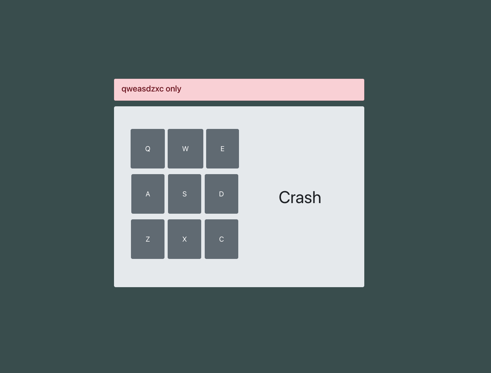

# Drum

Hi there 👋

This is my [Build a Drum Machine](https://www.freecodecamp.org/learn/front-end-libraries/front-end-libraries-projects/build-a-drum-machine) project.

## Get started 🔉
Use keys `Q W E A S D Z X C` to play. Each key corresponds to a specific drum sound. All sounds here are available at [SampleSwap](https://sampleswap.org/) for free

## Skills
  